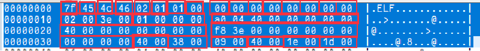

# linux可执行文件--ELF #

----------

  可执行文件在计算机科学中指一种内容可被电脑解释为程序的电脑文件。通常可执行文件内，含有以二进制编码的微处理器指令，也因此可执行文件有时称为二进制档。这些二进制微处理器指令的编码，于各种微处理器有所不同，故此可执行文件多数要分开不同的微处理版本。

   Windows 使用 PE（Portable Executable）格式或者 macOS 使用 Mach-O 格式作为可执行文件的默认格式。在 Linux 下，可执行文件通常采用 ELF（Executable and Linkable Format）格式。**ELF 文件包含了程序的代码、数据、符号表等信息，以及用于加载和执行程序的其他元数据。**

----------
## ELF文件类型 ##

ELF(EXECUTABLE  AND  LINKABLE  FORMAT):可执行的和可链接的格式(是文件格式的标准).o文件 和 可执行文件，都是目标文件，一般使用相同的文件格式。

ELF 文件主要分为以下三种类型。

**可重定位文件**：保存着代码和适当的数据，用来和其它的object文件一起来创建一个可执行文件或者是一个共享文件（主要是.o文件）
可执行文件：保存着一个用来执行的程序，该文件指出了exec(BA_OS)如何来创建程序进程映象（操作系统怎么样把可执行文件加载起来并且从哪里开始执行）。

**共享文件**：已经链接，保存着代码和合适的数据，用来被下面两个链接器链接：（主要是.so文件）。

**链接编辑器（静态链接）**：可以和其它的可重定位和共享object文件来创建其它的object。

**动态链接：**联合一个可执行文件和其它的共享object文件来创建一个进程映象。

----------
## ELF文件格式 ##
ELF 文件的作用有两个，一是用于程序链接（为了生成程序）；二是用于程序执行（为了运行程序）。

ELF文件的两种视图

**链接视图：**文件结构的粒度更细，将文件按功能模块的差异进行划分，最小的意义块单位是：节，静态分析的时候一般关注的是链接视图，能够理解 ELF 文件中包含的各个部分的信息。

**运行视图：**根本目的是考虑 ELF 文件是如何为程序运行做准备，由于考虑内存装载过程的一些优化考虑，将 ELF 文件从装载的角度重新划分 ELF 文件，最小的意义块单位是：段。

可执行文件会同时包含 Program Header Table 和 Section Header Table
目标文件通常只包含 Section Header Table。
共享库文件通常包含 Program Header Table 和 Section Header Table。

ELF文件格式

ELF文件头实例

ELF文件头解读

各个数据头的数据均能对应上。

----------

ELF Linking View解读

ELF Excute View解读

----------
## ELF Section head ##

ELF Section head解读

文件头中e_shoff标记位为0x3ef8 e_shentsize为0x40 e_shstrndx为0x1d
存放所有文件表名字的表头偏移量为 0x3ef8(16120) + 0x40(64) * 0x1d(29) = 0x4638(17912)

ELF Section head

ELF Section head实际内容

 

ELF Section

常见的Section

----------
## ELF Programe head ##

ELF Programe head解读

ELF Programe head

通过计算得出对应的偏移位置，与下图做对应。

ELF Programe解读

----------
# THANKS #
