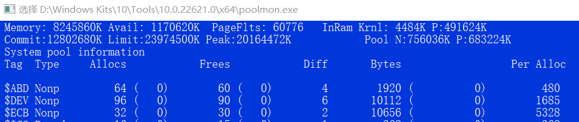

# PoolMon--分析内核内存泄漏工具 #

---------

## 简介 ##

当我们想要检测内核进程是否存在内存泄漏的时候，微软为我提供了一个工具--PoolMon。

PoolMon保存在 Visual Studio 扩展包的默认 WDK 中。所以下载 PoolMon需要先下载WDK工具。

----------

## PoolMon内容 ##

PoolMon 会显示以下有关内存分配的数据。数据按分配的池标签排序。

- 分配操作数和释放操作数（以及未释放的内存分配）。

- 两次更新之间分配操作数和释放操作数的变化。

- 按标签分列的内存分配总大小（以使用的字节数表示），以及平均分配大小。

- 两次更新之间所用字节数的变化。

- 分配标签值的驱动程序。

PoolMon 还会显示一般内存信息，包括总内存和可用内存、页面故障、内核物理内存、已提交内存和提交限制、峰值内存以及分页池和非分页池的大小。

使用 PoolMon，还可以

- 在 PoolMon 运行时对其显示内容进行排序和重新配置。

- 将配置的数据保存到文件中。

- 生成本地系统上驱动程序使用的标记文件（仅限 32 位 Windows）。

----------

## 分析内存泄露 ##

**
PoolMon的内容
**

例如上图中的ABD，持续检测tag为ABD的内存块，记录 Diff 和 Bytes 列中的值。 在对应从程序运行结束之后，再次比对 Diff 和 Bytes 列中的值，比如Diff的值从4涨到了6，那么在上述程序对应的运行过程中，存在两个ABD块的溢出。