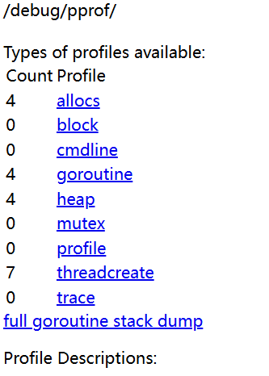
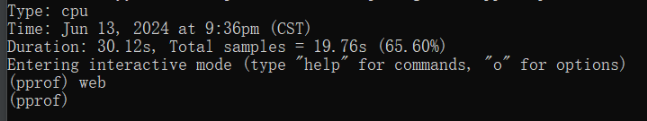
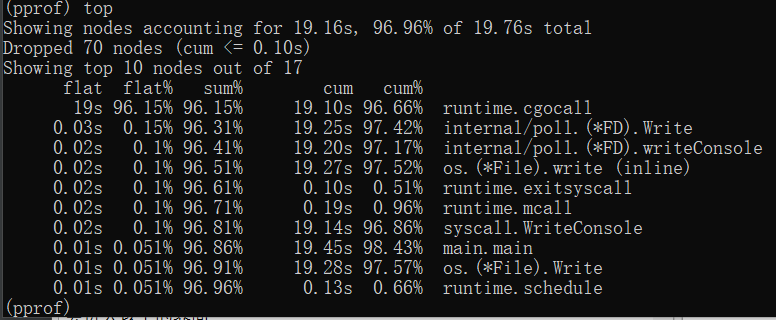
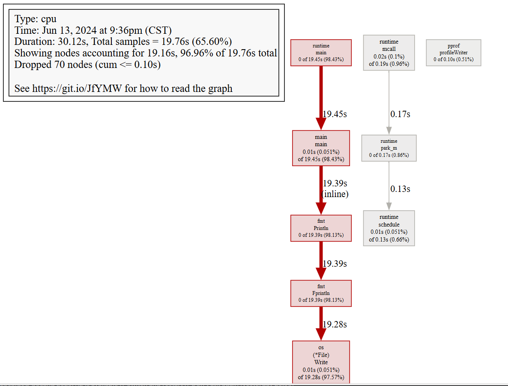

# pprof的使用 #

----------
## pprof简介 ##
pprof 是指在程序执行过程中，收集能够反映程序执行状态的数据。在软件工程中，性能分析（performance analysis，也称为 profiling），是以收集程序运行时信息为手段研究程序行为的分析方法，是一种动态程序分析的方法。

在go语言的开发中，我们需要感知系统的性能，从而了解自己功能对系资源的占用。在go开发中，我们通常通过 **pprof** 的使用进行性能分析来判断程序的CPU、内存、磁盘 IO、网络等，最终来突破程序中的性能瓶颈。

----------
## pprof的使用方法 ##
pprof是go语言中标准库中自带的功能，专门用来分析性能问题，安装go语言之后将会自带pprof工具，常用pprof命令如下

      go tool pprof

其中我想介绍两种采集pprof数据的方法：

- 通过本地记录，生产profile文件
- 通过监听端口，获取profile文件

----------
## 本地记录法 ##
在本地函数调用go语言的“runtime/pprof”库，启动StartCPUProfile函数，把数据写入一个文件。**适用于检测部分功能的性能。**以下是一个示例，展示如何实现。

	package main
	
	import (
		"fmt"
		"math"
		"os"
		"runtime/pprof"
	)

    func main() {
	    f, err := os.Create("profile")
    	if err != nil {
    		fmt.Println(err)
	    	return
    	}
	    defer f.Close()

	    if err := pprof.StartCPUProfile(f); err != nil {
	    	fmt.Println(err)
		    return
	    }
    	defer pprof.StopCPUProfile()

		sum := 0
		for i := 0; i < math.MaxInt8; i++ {
			sum += i
			fmt.Println(sum)
		}
		select {}
	}

该部分会将对应Profile数据存储在“Profile”文件中。从而通过pprof命令获取具体的profile数据。

----------
## 监听端口法 ##
在本地函数调用go语言的“net/http/pprof”库，启动一个监听，在访问指定端口的时候可以获取指定数据。**适用于检测整体功能的性能。**以下是一个示例，展示如何实现。

	package main
	
	import (
		"fmt"
		"math"
		"net/http"
		_ "net/http/pprof"
	)
	
	func main() {
	
		go func() {
			http.ListenAndServe("localhost:6060", nil)
		}()
	
		sum := 0
		for i := 0; i < math.MaxInt8; i++ {
			sum += i
			fmt.Println(sum)
		}
		select {}
	}

以上代码通过监听6060端口来获取pprof的数据，从而我们需要访问http://localhost:6060/debug/pprof/profile?seconds=30 来持续监听30s(时间可便变）获取对应的profile文件，进而进行分析。

我们还可以通过访问http://localhost:6060/debug/pprof/来获取进程消耗的具体内存。

pprof内存记录

----------
## 解析Profile文件 ##

首先我们借助以下命令来解析Profile文件

     go tool pprof profile

会进入以下的界面

pprof命令行界面

在该页面中使用top命令，可以获取里面每个堆栈具体占用的信息，如下图所示。

pprof top

在pprof命令行界面输入web命令，可以获得具体的火焰图信息，相当于top命令的更清晰的版本

pprof火焰图

以上就是pprof的使用方法，可以用来获取不同程序的性能信息，以便于优化。