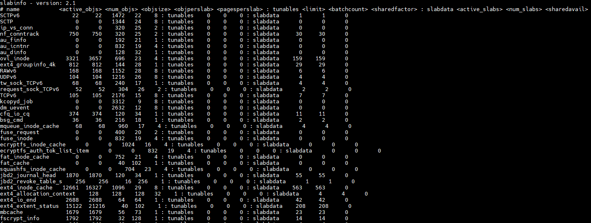

# linux slab分配器 #

----------
## slab简介 ##
slab分配器是linux中的一种内存分配器，从system中申请页面的基本单位。每个slab的大小不是固定的，为需要不同大小的内存分配准备着。
从以页为最小粒度来进行内存分配，转化为以slab为最小单位进行内存分配。

----------
## slab分配优势 ##
在linux内核中，内部存储的大多数数据，（如strcut task_strcuct，struct inode等数据结构）通常只需要**几字节到几百字节**，如果使用传统的4K的Page进行管理，就会有大量的空间被闲置，导致内存资源被浪费，新的object申请内存的时候，又要开辟一片新的内存，**导致内存资源浪费，页内部碎片化严重，内存分配效率低**。

反观slab分配器中，存在着多种对象，对应分配不同的内存大小，例如：

	kmalloc-128缓存负责管理65-128字节内存空间的的分配

保存管理型数据的缓存（即slab cache）和保存被管理对象的各个slab。每个缓存都负责一种对象类型。

----------
## slab结构 ##
以下是slabinfo中包含的字段和记录的内容

    <name>            ：obj名称
	<active_objs>     ：当前正在使用的对象数量。
	<num_objs>        ：总共可用的对象数量。
    <objsize>         ：每个对象的大小。
	<objperslab>      ：每个slab中的对象数量。
	<pagesperslab>    ：每个slab所占用的页数。
	<limit>           ：slab分配器的对象限制。
	<batchcount>      ：slab分配器每次从页中分配的对象数量。
	<sharedfactor>    ：用于计算slab共享页的因子。
	<active_slabs>    ：当前正在使用的slabs数量。
	<num_slabs>       ：总共可用的slabs数量。
	<sharedavail>     ：可用的共享页数量。

    <space>           ：总共占用的空间。（<objsize> * <num_objs>）

其中`<active_objs>`字段如果存在异常增加，表明可能存在内存泄漏。`<num_objs>`字段可以用于比较总共可用的对象数量与当前正在使用的对象数量，以确定是否有对象未被释放导致内存泄漏。而`<active_slabs>`字段，用于监测当前正在使用的slabs数量，如果持续增长，可能表示内存泄漏。

还可以用`<objsize> * <num_objs>`计算出每个slab的obj占用的总空间。

slab文件格式
